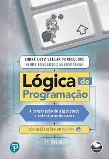
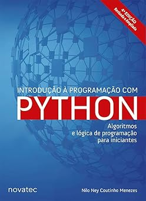

# Aprendizado de Python com Livros

Repositório voltado ao desenvolvimento de proficiência em programação com Python, reunindo scripts e notebooks elaborados a partir da leitura e resolução de exercícios de livros da área.

Novos conteúdos são adicionados à medida que cada obra é estudada, principalmente no formato scripts Python (`.py`) e, em alguns casos, notebooks Jupyter (`.ipynb`).

---

## Livros estudados / em estudo

<p>
  
</p>

### **Lógica de Programação**

*A construção de algoritmos e estruturas de dados com aplicações em Python – 4ª Edição*

---

<p>
  
</p>

### **Introdução à Programação com Python – 4ª Edição**

*Algoritmos e lógica de programação para iniciantes*

## Estrutura do repositório

Este repositório é organizado por obras estudadas.  
Dentro de cada obra, os conteúdos são separados por capítulos, e cada capítulo pode reunir exercícios resolvidos, programas em Python e notebooks Jupyter.

```text
livros_python_resolucoes/
├── img/
├── nome_da_obra_1/
│   ├── cap01/
│   │   ├── exercicios/
│   │   ├── programas/
│   │   └── notebooks/
│   ├── cap02/
│   │   ├── exercicios/
│   │   ├── programas/
│   │   └── notebooks/
│   └── materiais_apoio/
├── nome_da_obra_2/
│   ├── cap01/
│   │   ├── exercicios/
│   │   ├── programas/
│   │   └── notebooks/
│   └── cap02/
└── README.md